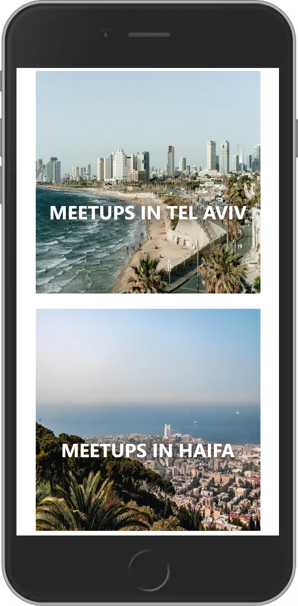

# MeetUp - A Next.js Project

I built this project in order to get familiar with Next.js framework, as it's an officially-recommended tool in React documentation.

<a href="">Click here to see the result.</a>

Tools I used: Next.js & SASS.

Here are some photos of the final product:

 

    
   

    

## What I Learned from this Project?

Building my first Next.js project was an exciting experience for me. I found the framework to be quite intuitive and easy to work with.

I learned about its main features: Server-side rendering / static site generation, automatic code splitting and hot module replacement and API routes. It's worth mentioning that this project was built with the classic way of using Next.js, as opposed to the newer method introduced in Next.js 13, so in my future projects I'll try the latter as well.

Overall, I found Next.js to be a powerful and flexible framework that allowed me to build fast, SEO-friendly web applications with ease.

In addition, I had the chance to implement SASS syntax in this project. While I personally prefer the expressiveness and syntax-oriented method of SCSS, I was happy to have the opportunity to work with SASS syntax in this project.
